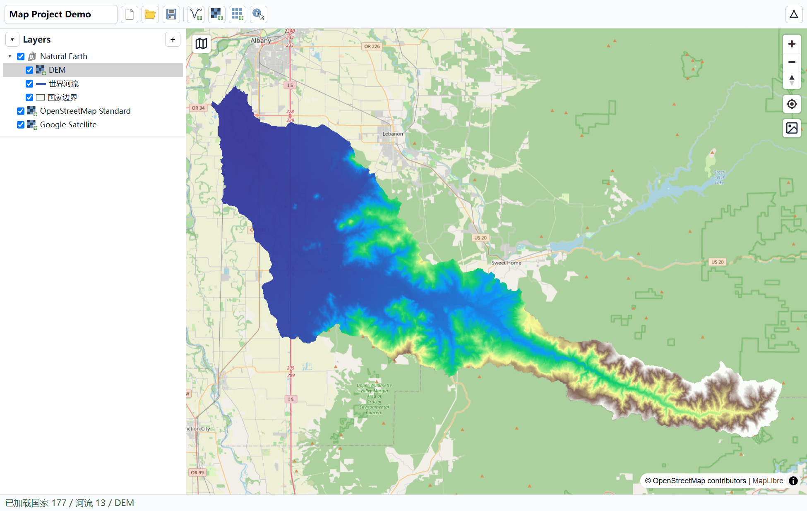

# GeoLibre Project Demo

- 以GeoLibre为底座
- GEE的Map绘图（后期方便对接所有GEE js代码）
- 仿QGIS的界面
- 仿GeoLibre的插件加载系统

- `@geolibre/core` 的 Project/Layer/Group/Style
- `@geolibre/map/headless` 的图层同步

```bash
npm install
npm run dev
```

- Project 默认保存为 `public/projects/<ProjectName>.geolibre.json`；旧 UUID 文件在下次保存时自动迁移，同名新 Project 须先改名。
- Project 仅保存配置与数据路径；本地数据独立写入 `public/projects/<project-key>/data/`。
- 支持远程打开、保存、删除；导入、导出使用本地 Project JSON。
- 本地 GeoTIFF 在首次 Remote 保存前暂存于浏览器 IndexedDB。

控制台：

```js
// 本地
Map.addLayer(ee.FeatureCollection(fc), { color: "1d4ed8", width: 2 }, "河流")
Map.addLayer(ee.Image("https://.../dem.tif"), { palette: "terrain" }, "DEM")
// GEE（需 ee.Initialize）
Map.addLayer(ee.Image("USGS/SRTMGL1_003"), { min: 0, max: 3000 }, "SRTM")
```


